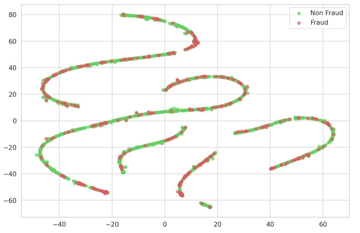
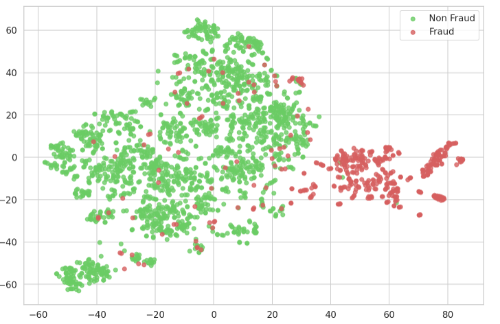
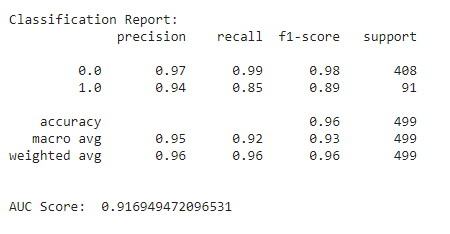
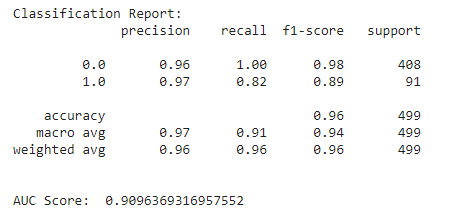
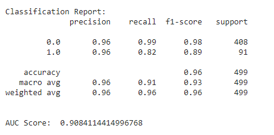
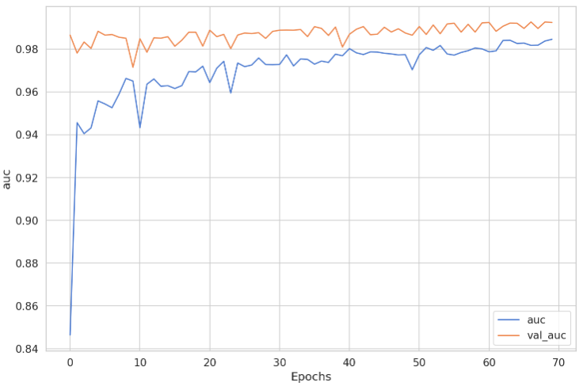

# Credit-card-fraud-detection
The pupose of this project is to leverage machine learning and find out fradulent transactions of the credit cards. The idea is to prevent fradulent acitivity only by analyzing credit card transaction data. The transaction data that has been used is highly imbalanced, having only 0.2% fraud cases. The overall challenge is to make a supervised model which can detect fraud tracsactions from the normal trasactions. The data can be found in the following link:

https://www.kaggle.com/mlg-ulb/creditcardfraud

• TSNE plot is used to visualize the transaction data.  
• An autoencoder model is trained using the data.  
• The encoded layer is extracted from the autoencoder as a feature extraction technique.   
• The extracted features are used to train different classification models. 
  e.g., SVM, Logistic Regression, KNN and Artificial Neural Network (MLP).  
• The best model (MLP- Multi Layer Perceptron) is trained with dropout layers, L1 regularization and achieves AUC = 0.97.   

## Before Feature Extraction:

## After Feature Extraction:

## Performance:
### Linear Regression:

### SVM:

### KNN:

### MLP:

